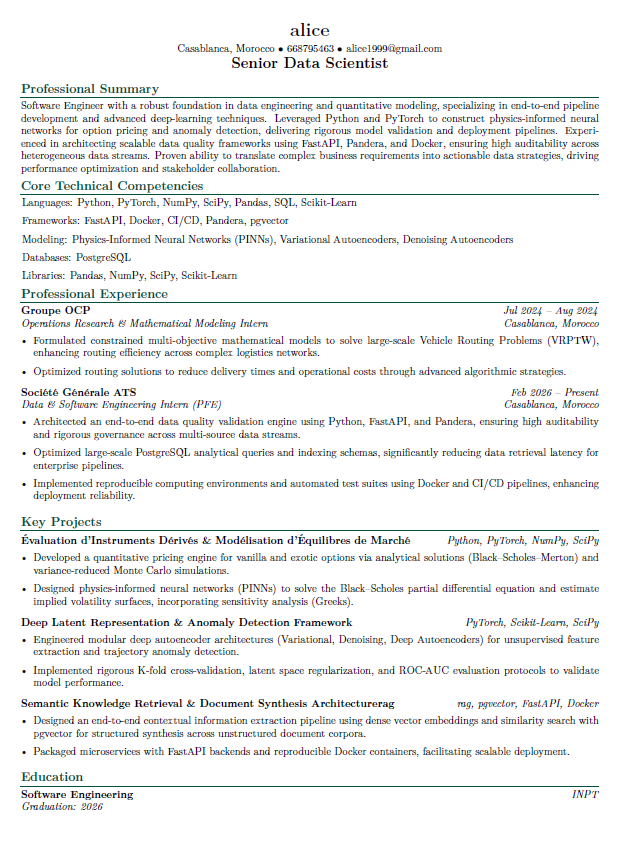

# CurateCV Frontend

CurateCV is a React frontend for building application-ready CVs from a job offer and a reusable career profile. A user adds their education, contact details, projects, and professional experience once, then uses that profile to find the strongest evidence for each new opportunity.

The interface is intentionally focused: extract the offer, enrich the profile, select the best matches, and generate a tailored PDF.

## Product Preview

The home page introduces the workflow with a three-step visual guide and a generated-CV preview.


| Generated CV preview
|  

## User Flow

```text
Job offer
	|
	v
Offer extraction -> skills, requirements, keywords
	|
	v
Profile enrichment -> upload CV or add projects and experiences
	|
	v
Semantic retrieval -> strongest projects and experiences
	|
	v
Match selection -> user confirms the evidence
	|
	v
Tailored CV -> PDF preview and download
```

### 1. Analyze the offer

The user pastes a complete job description. The frontend sends it to the offer-extraction endpoint and displays the detected role, technical skills, and required experience.

### 2. Build the profile

The profile can be populated in two ways:

- Upload an existing PDF CV for extraction and indexing.
- Add one project or experience manually at a time.

Manual entries are sent immediately to the dedicated upload endpoints. They are persisted as profile data, not treated as locally selected match results.

### 3. Retrieve and select evidence

When the user continues, the frontend requests project and experience matches based on the extracted offer criteria. Only the retrieval response becomes selectable evidence in the match step.

### 4. Generate the application CV

The selected projects and experiences, together with the offer insights, are sent to the generation API. The returned PDF is rendered in the final preview step and can be downloaded by the user.

## Frontend Architecture

```text
src/
├── API_Settings/
│   └── api.jsx                 # Authenticated API client and endpoint modules
├── components/
│   ├── layout/                 # Header, footer, background, and route shell
│   ├── services/               # Workflow steps and loading states
│   └── ui/                     # Shared interface elements
├── hooks/service/              # React Query mutations for workflow operations
├── pages/
│   ├── Home.jsx                # Product entry point and workflow explanation
│   ├── Login.jsx               # Existing-user authentication
│   ├── SignIn.jsx              # Account creation and optional CV ingestion
│   ├── Service.jsx             # Protected CV tailoring workflow
│   └── schemas/                # Zod response validation
├── index.css                   # Shared visual language and workflow styling
└── App.jsx                     # Public and protected route definitions
```

### Main frontend responsibilities

- **React Router** controls public routes and protects `/generate` behind authentication.
- **TanStack Query** manages asynchronous extraction, retrieval, and generation mutations.
- **Zod schemas** validate offer extraction, CV extraction, and retrieval responses before rendering them.
- **Lucide React** supplies the interface icons used by the workflow guide and controls.
- **Tailwind CSS** provides responsive layout utilities, while `src/index.css` contains the shared dark/green visual treatment.

## Routes

| Route | Access | Purpose |
| --- | --- | --- |
| `/` | Public | Product introduction and CV workflow overview |
| `/login` | Public | Sign in to an existing account |
| `/signin` | Public | Create an account and optionally ingest a CV |
| `/generate` | Protected | Analyze an offer, select evidence, and generate a CV |

## API Integration

The frontend uses the centralized client in `src/API_Settings/api.jsx`. It automatically attaches the stored bearer token to protected requests, handles JSON and multipart payloads, redirects expired sessions to login, and supports binary PDF responses.

| Frontend operation | Endpoint |
| --- | --- |
| Sign in | `POST /auth/login` |
| Create account | `POST /auth/sign_in` |
| Extract and persist an uploaded CV | `POST /extraction/process-cv` |
| Add a project | `POST /uploading/add_project` |
| Add an experience | `POST /uploading/add_experience` |
| Extract offer insights | `POST /extraction/offer_extraction` |
| Retrieve matching projects | `POST /rag/retrieval/projects` |
| Retrieve matching experiences | `POST /rag/retrieval/experiences` |
| Generate tailored PDF | `POST /generation/get_cv` |

## Getting Started

### Requirements

- Node.js 18 or newer
- npm
- Access to the CurateCV API

### Install and run

```bash
npm install
npm run dev
```

Vite starts the local development server and enables hot module replacement.

### Production build

```bash
npm run build
npm run preview
```

### Deployment

The project includes a GitHub Pages deployment script:

```bash
npm run deploy
```

The `homepage` field in `package.json` is configured for the deployed project path.

## Available Scripts

| Script | Description |
| --- | --- |
| `npm run dev` | Start Vite development mode |
| `npm run build` | Create a production build |
| `npm run preview` | Preview the production build locally |
| `npm run deploy` | Build and publish `dist/` with GitHub Pages |

## Design Direction

The frontend uses a restrained dark interface with green action accents to keep attention on the user’s career data. The home page uses a portrait CV preview, strong workflow markers, compact explanatory copy, and responsive stacking so the experience remains readable on smaller screens.

The service workflow follows the same visual language across loading states, extraction feedback, manual entry forms, match selection, and PDF generation.

## Notes for Contributors

- Keep API calls inside the endpoint modules and workflow hooks rather than calling `fetch` from presentation components.
- Preserve the distinction between persisted profile records and retrieval results. The match-selection step should be driven by retrieval responses.
- Validate new API response shapes in `src/pages/schemas/extraction.tsx` before rendering them.
- Keep new UI states responsive and keyboard accessible, especially upload controls, forms, and selectable match items.
# React + Vite

This template provides a minimal setup to get React working in Vite with HMR and some ESLint rules.

Currently, two official plugins are available:

- [@vitejs/plugin-react](https://github.com/vitejs/vite-plugin-react/blob/main/packages/plugin-react) uses [Oxc](https://oxc.rs)
- [@vitejs/plugin-react-swc](https://github.com/vitejs/vite-plugin-react/blob/main/packages/plugin-react-swc) uses [SWC](https://swc.rs/)

## React Compiler

The React Compiler is not enabled on this template because of its impact on dev & build performances. To add it, see [this documentation](https://react.dev/learn/react-compiler/installation).

## Expanding the ESLint configuration

If you are developing a production application, we recommend using TypeScript with type-aware lint rules enabled. Check out the [TS template](https://github.com/vitejs/vite/tree/main/packages/create-vite/template-react-ts) for information on how to integrate TypeScript and [`typescript-eslint`](https://typescript-eslint.io) in your project.
